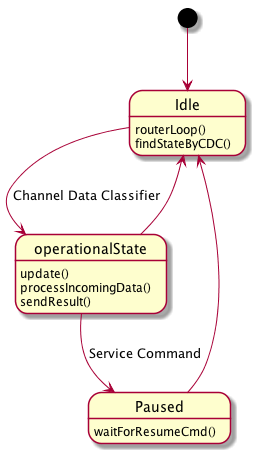

.. _esystem_osm:

Operational State Machine
=========================

The :ref:`esystem_osm` is a
`Finite State Machine <http://en.wikipedia.org/wiki/Finite-state_machine>`_
with predefined operational states. It can be in only one operational state at
a time. The transition from one operational state to another can be initiated
by a *Triggering Event* (device interrupt) or *Condition* (based on :ref:`cdc`).

State Diagram
-------------

Operational States
------------------

* :ref:`cdc_urg_0x0A`
* :ref:`cdc_bdcreq_0x0A`
* :ref:`cdc_bdcreq_0x0B`
* :ref:`cdc_bdcreq_0x0C`

