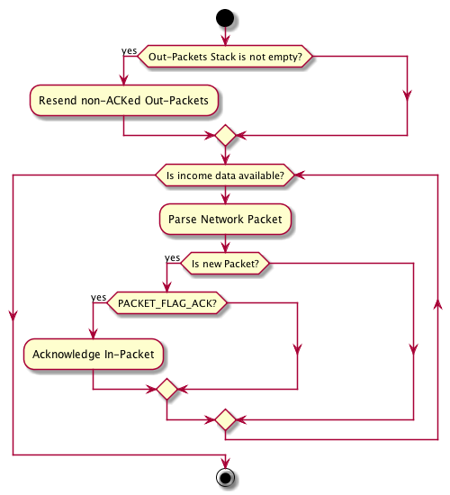

.. _esystem_router:

Router
======

The :ref:`esystem_router` service resides on *Network Layer* of
:ref:`netmodel`. It operates with *Packet* structures and performs the next
tasks:

* Parsing of incoming *Packet* from "bytes flow"
* Acknowledging of incoming *Packet* if it has ``PACKET_FLAG_ACK``
* Sending an outgoing *Packet*
* Operating with Stack of outgoing *Packets*

Activity Diagram
----------------

